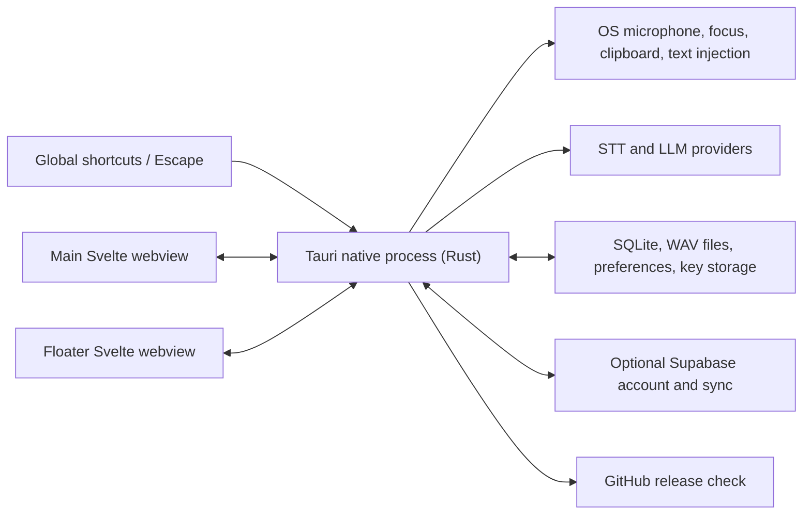
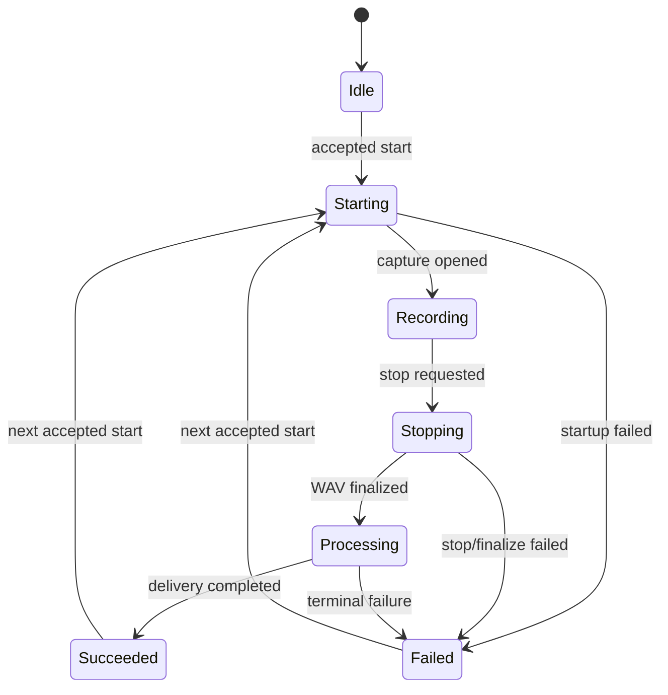

# wispr-fox desktop architecture

This is the canonical architecture document for the desktop client. It maps the
current implementation and defines the recording/session contract. It does not
replace release notes or the shared sync protocol.

- Baseline reviewed: `v3.3.0-nightly.1`; current release candidate:
  `v3.3.0-nightly.2` on 2026-08-14.
- `Current` means this working tree as reviewed on 2026-08-14. The adaptive
  coordinator is implemented here, but no later release tag is implied.
- The state, input, and snapshot rules below are normative. Gaps in automated or
  installer-level verification are called out explicitly rather than weakening
  the behavior contract.
- Shared desktop/web/mobile sync semantics live in
  `../wispr-fox-web/docs/SYNC_DESIGN.md`.

## System boundary



The native process owns microphone capture, persistence, provider calls,
delivery, global shortcuts, and sync. The webviews are presentation and user
input surfaces; they must not become independent authorities for recording
lifecycle state.

## Current implementation

### Native modules

| Area | Owner | Responsibility |
|---|---|---|
| Bootstrap and IPC | `src-tauri/src/lib.rs`, `commands.rs` | Tauri/plugins, windows, command registration, app-data setup, recovery, background workers |
| Input | `hotkey.rs`, `adaptive.rs`, `touchbar.rs`, `tray.rs` | Four adaptive global bindings, physical-edge reduction, macOS Touch Bar, tray actions; legacy sticky fields deserialize but are inactive |
| Orchestration | `flow.rs` | Serialized live-session ownership, revisioned snapshots, uploads, retry/regeneration, pipeline stages, history updates, delivery events |
| Capture and audio | `audio/` | Cold-start `cpal` stream, WAV writing, device resolution, metering, cues, denoise, level rescue, format conversion |
| Speech and writing | `stt/`, `llm/`, `clippy.rs` | Provider adapters, chunking/diarization, prompts, cleanup/drafting, timeouts |
| Delivery | `inject/` | Focus capture/restore, Windows `SendInput`, macOS `CGEvent`, clipboard fallback |
| Local data | `history/`, `gc.rs`, `usage.rs` | SQLite/WAL schema, retention, timing/diagnostic metadata, daily usage rollups |
| Configuration and secrets | `settings.rs`, `secrets.rs` | Backend settings snapshot, keyring-first provider keys, local fallback, no-secret audit events |
| Accounts and sync | `sync/` | Optional auth, transcript/settings push-pull, tombstones, purge propagation |
| Platform lifecycle | `power.rs`, `cursor_poller.rs` | Resume detection and retained platform/window helpers |

### Frontend modules

| Area | Owner | Responsibility |
|---|---|---|
| Application shell | `src/routes/+layout.svelte` | Navigation, settings initialization, account startup, global event mirrors |
| Floater | `src/routes/clippy/+page.svelte` | Avatar, state animation, status/error bubbles, live waveform, window sizing |
| History and meetings | `src/routes/history/`, `src/lib/HistoryRow.svelte`, meeting dialogs | Search, playback, transcript variants, rerun, speaker labels, reading mode |
| Settings | `src/routes/settings/`, `src/lib/settings-store.svelte.ts` | Preference persistence, provider/key controls, hotkey rebinding, mic test |
| Onboarding and stats | `src/routes/onboarding/`, `src/routes/stats/`, `src/lib/stats.ts`, `voice-insights.ts` | First-run setup and on-device derived insights |
| IPC contract | `src/lib/api.ts` | Manually maintained TypeScript command/event facade |

### Current live-dictation flow

1. `hotkey.rs` turns one of four configured OS bindings into a physical
   `Down`/`Up` event with a stable trigger ID, mode, and force-clean intent.
2. `adaptive.rs` reduces those edges under the `FlowState` mutex. A physical-key
   latch ignores repeat Down events until the matching Up; the monotonic 700 ms
   boundary decides latch versus hold-to-talk.
3. An accepted Down allocates the session, capture generation, immutable mode,
   target intent, and `Starting` snapshot before any await. Escape is armed at
   this point. An Up received during cold startup is retained and applied when
   capture completes.
4. Startup captures focus, inserts the History row, then opens a generation-tagged
   audio stream. Failure closes or marks all partial resources and publishes one
   terminal snapshot. Dictation and preview mic readiness have distinct sources.
5. Stop/finalize transitions into Processing while the session remains owned;
   trim, optional denoise/level rescue, STT, optional LLM, history/stats/title,
   focus restoration, and injection/clipboard delivery run without permitting a
   second session. A competing start receives an informational busy notice.
6. The floater consumes the revisioned `FlowSnapshot`, rejects old revisions,
   and rehydrates with `get_flow_snapshot` on mount/focus. Provider labels,
   warnings, messages, and level samples remain supplementary presentation events.
7. Completed rows can trigger best-effort account sync. Audio is never synced.

### Current shortcut behavior

| Intent | Windows default | macOS default | Current behavior |
|---|---|---|---|
| Transcribe | `F8` | `Option+Space` | Tap to latch; hold to talk |
| Draft | `F9` | `Option+Enter` | Tap to latch; hold to talk |
| Force-clean Transcribe | `Shift+F8` | `Shift+Option+Space` | Tap to latch; hold to talk |
| Advanced cleanup | User-configurable | User-configurable | Tap to latch; hold to talk |
| Stop | `Escape` while armed | `Escape` while armed | Stops and continues through transcription/delivery |
| Floater/Touch Bar | Click/tap | Click/tap | Discrete toggle of the active/original mode |

## Adaptive input and session coordinator

This section is both the normative contract and the current coordinator design.

### User behavior contract

The initial adaptive threshold is **700 ms**, measured with a monotonic clock
from physical Down to Up.

| Input | Required result |
|---|---|
| Release before 700 ms | Treat as a tap. Recording remains latched until another dictation-key Down or Escape. |
| Release at or after 700 ms | Treat as hold-to-talk. Release stops and sends the recording. |
| Up while capture is still starting | Preserve the release intent and apply it after startup; never discard Up. |
| Another dictation-key Down while latched | Stop the existing session using its original mode; consume the new key's later Up. |
| Auto-repeat Down while the physical key is held | Ignore until the matching Up. A time-only debounce is insufficient. |
| Floater or Touch Bar action | Send a discrete Toggle command because these inputs have no reliable hold edge. |
| Escape | Stop and send the active session. If discard/cancel is added, it must be a distinct command and copy. |

The initiating Down fixes mode, force-clean, target focus, and delivery intent.
A stop input must never change those properties.

### Authoritative state machine



After `Succeeded` or `Failed`, runtime ownership is available immediately but
the terminal snapshot remains available for rehydration until the next accepted
session replaces it.

`Recording` separately carries an input disposition:

- `Undecided { trigger_id, down_at, key_is_down }`
- `Latched`
- `HoldToTalk`

The `AdaptiveReducer`, `FlowState`, and transition-order mutex form one
serialized coordinator; the order lock spans state mutation, Escape
registration, snapshot/legacy publication, and effect dispatch. Input
interpretation never runs as independent per-edge tasks. It reserves a
session and enters `Starting` before awaiting audio. Every async effect returns
with its session ID, and capture readiness also carries generation and source;
stale completions are ignored. The session remains owned through `Processing`,
so pipelines do not overlap. A start attempted while busy receives a non-error
busy status rather than creating a second session.

### Snapshot and event contract

Lifecycle authority is one structured, versionable snapshot:

```text
FlowSnapshot {
  revision: u64,
  session_id: optional UUID,
  phase: Idle | Starting | Recording | Stopping | Processing
         | Succeeded | Failed,
  stage: optional Transcribing | Denoising | Cleaning | Injecting,
  mode: optional Transcribe | Draft,
  input: optional Undecided | Latched | HoldToTalk,
  mic: Inactive | Waking | Live | Unavailable,
  mic_ready_ms: optional integer,
  notice: optional { code, severity, summary, detail_ref }
}
```

- Emit `Starting` before opening the stream and arm Escape at the same accepted
  start boundary.
- Route the first-buffer callback through the coordinator and tag it with the
  dictation session. Mic preview has a separate source identity.
- Increment `revision` on every accepted transition. Frontends ignore older
  revisions and completions from another session.
- Provide `get_flow_snapshot()` and call it on webview mount, focus, and resume.
- Rust owns lifecycle. Frontends may animate a snapshot but may not force the
  backend to idle or manufacture a terminal result.
- Emit exactly one terminal result/notice per session. Raw detail belongs in
  History/diagnostics; the floater receives concise actionable copy.
- A new session clears prior transient notices and flushes obsolete dwell/toast
  state. Any accepted revision supersedes older lifecycle presentation.

### Required invariants

1. At most one end-to-end dictation session is active, including processing.
2. Every accepted Down has one tracked physical-key lifecycle until Up.
3. A release or stop request received during `Starting` is durable.
4. Capture startup is transactional: any later startup failure stops the stream
   and closes or marks the History row.
5. Mode, force-clean, focus target, and session ID are immutable after start.
6. Mic readiness, progress, warnings, and errors are scoped to one session.
7. Each session has one terminal outcome and one authoritative persisted status.
8. Frontend remount, missed events, or delayed animation cannot change backend
   state; resync always converges to the latest snapshot.
9. User-visible errors are readable without ellipsis. Longer diagnostics remain
   available from History rather than a fixed two-line floater.

## Persistence and data ownership

| Store | Contents | Lifetime and boundary |
|---|---|---|
| Platform app-data `history.sqlite` | Recording status, transcript variants, meeting/speaker metadata, provider/timing diagnostics, sync metadata, daily stats | SQLite/WAL; stranded in-progress rows are marked Error at startup |
| Platform app-data `audio/` | Dated local WAV recordings | Local only; retention and size GC apply; remote rows have no local audio |
| `user-prefs.json` | Hotkeys, provider/model IDs, device and UI/application settings | `tauri-plugin-store`; pushed into Rust at frontend initialization |
| OS keyring plus local fallback | Provider keys and auth material | Keyring-first. Provider-key fallback is DPAPI-protected on Windows; legacy plaintext provider-key files are migration-only |
| `secret-audit.jsonl` | No-secret storage-operation metadata | Local diagnostics; currently append-only and unbounded |
| Webview localStorage | Avatar visibility/placement/scale and presentation markers | Per-webview presentation state; never lifecycle authority |
| Supabase, when signed in | Transcript records, selected provider keys, devices, tombstones, purge marker | Optional cross-device boundary; audio never leaves the device through sync |

Transcript audio and text are sent to the providers the user selects. Optional
LLM cleanup/drafting sends transcript text to the selected LLM provider.

## Trust boundaries

- **Webview to native IPC:** CSP is constrained, but the current `main` and
  `clippy` webviews share a broad capability set and the command surface contains
  sensitive data/destructive operations. The target is least-privilege
  capabilities per window and typed command/event contracts.
- **Microphone and delivery:** capture crosses OS microphone permissions;
  injection crosses focused-app, Accessibility, `SendInput`/`CGEvent`, and
  clipboard boundaries. Focus drift must fail to clipboard or a visible error,
  never paste into an unrelated target.
- **Secrets and sync:** provider keys are local unless optional account sync is
  enabled; the sync design and RLS rules are part of the product security model.
  Refresh-token fallback and server-side key storage require explicit disclosure.
- **Remote services:** STT/LLM providers, Supabase, and GitHub Releases are the
  only intended network destinations. There is no telemetry or crash reporter.
- **Build trust:** Windows artifacts are not code-signed; macOS artifacts are not
  notarized and stable self-signing is not yet enabled. Production currently
  includes the Tauri `devtools` feature.

## Update and release topology

1. Keep the version identical in `package.json`, `src-tauri/Cargo.toml`, and
   `src-tauri/tauri.conf.json`.
2. Add `docs/RELEASE_NOTES_<tag>.md`; CI refuses a tag without the exact file.
3. A pushed `v*` tag starts `.github/workflows/release.yml`.
4. CI creates one draft release, builds Windows x64, Apple Silicon macOS, and
   Linux artifacts in a matrix, then publishes only after all builds succeed.
5. `-nightly`, `-rc`, `-beta`, and similar tags publish as prereleases. Stable
   promotion requires an explicit user signal.
6. The app does not self-update. It queries GitHub Releases, compares a reported
   version, and opens the release page for manual installation.

Release CI verifies version/tag/release-note alignment, runs `npm run check`,
Rust library tests, and `cargo check --all-targets` before it creates a draft.
It still lacks browser/UI tests, signing, artifact checksums, and an SBOM.

## Verification matrix

| Area | Required gate | Current coverage |
|---|---|---|
| Coordinator reducer | Table-driven tests for tap/hold boundary, Up-during-Starting, repeat suppression, second-key/Escape, busy/direct-toggle behavior | Seven deterministic reducer tests pass standalone; six Flow-helper tests cover queued completion, ownership, busy, and stale generation/completion paths |
| Capture transaction | Gated fake audio tests for start/DB/stop failure cleanup and exactly one terminal outcome | Transactional paths are implemented; injected-failure tests are missing |
| Session events | Mic readiness before/after startup, rapid restart, old-session rejection, snapshot remount/resume | Generation/source and revision checks are implemented; automated integration tests are missing |
| Pipeline concurrency | Prove no second session starts during Starting/Stopping/Processing | Reducer busy semantics are covered; full pipeline concurrency test is missing |
| Rust leaf logic | WAV conversion, denoise/level, speaker grouping, provider parsing, timeout/history tests | Partial; reducer coverage added, broader flow effects still need fakes |
| Frontend contracts | `npm run check`, build, typed snapshot decoding, revision filtering | Typed snapshot and filtering implemented; lifecycle UI tests missing |
| Floater visual QA | Long warning/error at every avatar and S/M/L scale; no clipping; reduced motion | Error geometry reserves a bounded reading band and scrolls overflow; runtime visual matrix remains manual |
| Windows end-to-end | Fast and slow cold-start devices; tap/hold F8/F9/force-clean; focus drift; restart/resume | Manual installer test required |
| macOS end-to-end | Option shortcuts, Escape, Accessibility/injection, Touch Bar, update grant persistence | Manual Apple Silicon test required; signing pending |
| Linux end-to-end | Install, capture, provider call, clipboard delivery | Built but not daily-driven |
| Sync | Signed-out isolation, signed-in push/pull, remote row without audio, tombstone/purge live test | Delete/purge live verification still owed |
| Release | Check/tests before release creation, three artifacts from one commit, release-note lookup, prerelease channel | Verify-before-draft gate implemented; signing/checksum/SBOM gates missing |

Local verification must respect the workspace constraint: use `cargo check` as
the native local gate; do not run a heavy local Tauri production build.

## Known architectural gaps

- Capture startup/finalization is transactional in production code, but fake
  audio/database failure injection does not yet prove every cleanup branch.
- Rust and TypeScript settings/snapshot types remain manually duplicated. The
  known `denoising`/`drafting` drift is corrected, but generated contracts would
  prevent recurrence.
- `flow.rs`, the floater page, and `commands.rs` still combine too many concerns;
  effect adapters and presentation reducers would make integration tests cheaper.
- Secret audit storage has no rotation; refresh-token fallback is plaintext when
  keyring verification fails; both webviews share broad native privileges.
- Update selection uses the first GitHub release returned, not the maximum
  compatible version/channel, and its comparator is untested.
- README and getting-started hotkey/account/privacy claims are reconciled with
  this contract. Broader roadmap and long-form handover chronology still contain
  historical snapshots; release notes remain immutable.
